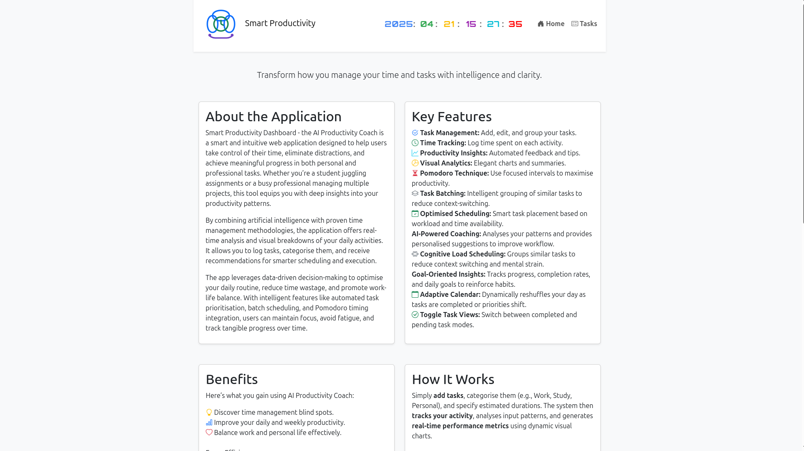
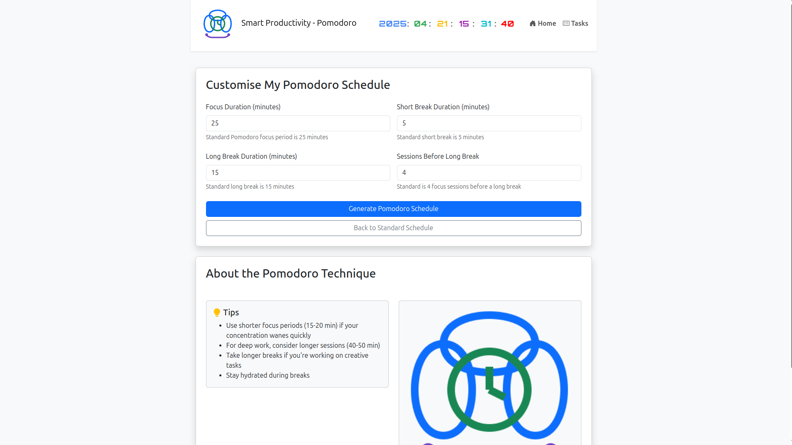

# 🧠  AI-Based Productivity Coach

A dynamic, intelligent task and time management tool designed to optimise productivity using real-time analytics, visual progress feedback, and cognitive-friendly scheduling.


## 🚀 Overview

<div align="justify">
The AI-Based Productivity Coach is a Flask-based web application that helps users manage their tasks, visualise progress, and improve focus through features like Pomodoro recommendations and cognitive load balancing. Built for individuals and teams who want to make the most out of their time, this tool intelligently analyses user inputs and adapts daily workflows dynamically. This web-based productivity dashboard is designed to help individuals, students, and professionals organise their tasks, manage their time, and track their daily activities with enhanced efficiency. Built using Flask, HTML, CSS, and JavaScript, the application integrates smart scheduling tools and visual progress indicators to provide users with an intuitive and interactive experience. It supports dynamic task updates, categorisation, and daily summaries, empowering users to prioritise their goals and stay focused. By incorporating productivity techniques like the Pomodoro method and intelligent task batching, the application fosters a well-structured approach to time management. Whether you're working on personal goals or managing multiple professional commitments, this dashboard is tailored to improve productivity, ensure optimal use of time, and support a balanced workflow.
</div>


## Table of Contents
- [Features](#features)
- [How it works](#HowItWorks)
- [Tech Stack](#TechStack)
- [Project Structure](#Project_Structure)
- [Screenshots](#Screenshots)
- [Directory and File Descriptions](#Directory_and_File_Descriptions)
- [Application Flow](#Application_Flow)
- [Development Guidelines](#DevelopmentGuidelines)
- [Installation](#installation)
  - [Prerequisites](#prerequisites)
  - [Fork and Clone the Repository](#fork-and-clone-the-repository)
  - [Setting up a Python Virtual Environment](#setting-up-a-python-virtual-environment)
  - [Installing Dependencies](#installing-dependencies)
- [Running the Application](#running-the-application)
- [Usage Guide](#usage-guide)
- [Troubleshooting](#troubleshooting)
- [Getting Help](#GettingHelp)
- [Contributing](#Contributing) 
- [Contributing](#contributing)
- [License](#license)
- [About Pomodoro Technique](#AboutPomodoroTechnique)

---

## ✨ Features

- ✅ **Smart Task Manager** – Add, categorise (Work, Study, Personal), prioritise, and estimate time for tasks.
- ⏳ **Focus Session Management** – Integration of the Pomodoro Technique for structured, time-blocked productivity.
- 🔄 **Optimised Scheduling** – Smart scheduling engine adjusts your task list based on time availability, priority, and focus state.
- 📊 **Visual Analytics** – Real-time charts, animated completion indicators, and habit reinforcement graphs.
- 🧠 **AI-Powered Coaching** – Analyses your patterns and provides personalised suggestions to improve workflow.
- 🧩 **Cognitive Load Scheduling** – Groups similar tasks to reduce context switching and mental strain.
- 🎯 **Goal-Oriented Insights** – Tracks progress, completion rates, and daily goals to reinforce habits.
- 📅 **Adaptive Calendar** – Dynamically reshuffles your day as tasks are completed or priorities shift.
- ⏱ **Pomodoro Cycle Recommendations** – Recommends focus intervals tailored to workload and cognitive patterns.
- 🔁 **Task Batching** – Suggests grouping of related tasks for efficiency.
- ✅ **Toggle Task Views** – Switch between completed and pending task modes.
- 📆 **End-of-Day Summary** – Provides a daily wrap-up with progress stats and resets.
- 📱 **Responsive Design** – Optimised for both mobile and desktop viewing.
- 🕒 **Live Clock & Date Display** – Keeps you aware of time while planning your workflow.
- 🎬 **Animated Transitions** – Smooth, interactive updates on task completion and changes.

---

## 🔍 How It Works

1. **Input Tasks**
   - Define tasks with category, priority, and duration. Add descriptions to enrich your planning.

2. **System Analysis**
   - Your task data is analysed for time allocation, category dominance, focus depth, and habits.

3. **Interactive Feedback**
   - View animated charts and progress bars showing how your time is being used and your completion rates.

4. **Smart Suggestions**
   - Receive Pomodoro interval recommendations and coaching tips based on your patterns.

5. **Dynamic Updates**
   - Your task list and calendar dynamically adapt to your real-time actions and changing priorities.

---

## 🛠️ Tech Stack

- **Backend**: Python (Flask)
- **Frontend**: HTML5, Bootstrap, AOS.js, Chart.js
- **Database**: SQLite (default) / PostgreSQL (optional)
- **Visualisation**: Chart.js, progress bars, animated task cards
- **Deployment**: Flask CLI, Gunicorn, Docker-ready,Apache2

---


## 📁 Project Structure

```
📦 AI-Based-Productivity-Coach/
├── 📁 app
│   ├── __init__.py
│   ├── logic.py
│   ├── routes.py
│   ├── 📁 static
│   │   ├── 📁 assets
│   │   └── 📁 charts
|   |
│   └── 📁 templates
│       ├── base.html
│       ├── dashboard.html
│       ├── 📁 include
│       ├── index.html
│       ├── pomodoro_settings.html
│       └── tasks.html
├── config.py
├── main.py
├── README.md
└── requirements.txt
```


## 📸 Screenshots

| Home Page |  |
|----------|-----------|
| |
| Dashboard |  |
|----------|-----------|
| |
| Pomodo Schedule |  |
|----------|-----------|
| |

## Directory and File Descriptions

### Root Directory

- **main.py**: Application entry point. Initializes and runs the Flask application.
- **config.py**: Configuration file containing settings like host, port, and debug mode.
- **requirements.txt**: Lists all Python dependencies required by the application.
- **README.md**: Documentation on how to install and use the application.

### `app` Directory

The main application package containing all application code.

- **__init__.py**: Initializes the Flask application and brings together all components.
- **logic.py**: Contains the core business logic of the productivity coach.
- **routes.py**: Defines all application routes and view functions.
- **static**: Directory for static assets (CSS, JavaScript, images).
- **templates**: Directory for HTML templates used in the application.


## Application Flow

1. The application starts from `main.py`, which imports and runs the Flask application.
2. The Flask application is defined and configured in `app/__init__.py`.
3. Routes in `routes.py` handle HTTP requests and interact with the logic layer.
4. Core functionality is implemented in `logic.py`.
5. Views are rendered using templates from the `templates` directory.
6. Static assets are served from the `static` directory.

## Development Guidelines

- New routes should be added to `routes.py`
- Business logic should be implemented in `logic.py` or in new modules within the `app` package
- Frontend assets should be placed in appropriate directories under `static`
- HTML templates should be placed in the `templates` directory


## Installation

### Prerequisites

Before installing the AI-Based Productivity Coach, ensure you have the following installed on your system:

- Git
- Python 3.8 or higher
- pip (Python package installer)

### Fork and Clone the Repository

1. **Fork the repository**:
   - Visit https://github.com/imosudi/AI-Based-Productivity-Coach
   - Click on the "Fork" button in the top-right corner
   - This creates a copy of the repository in your GitHub account

2. **Clone your forked repository**:
   ```bash
   git clone https://github.com/YOUR_USERNAME/AI-Based-Productivity-Coach.git
   ```

3. **Navigate to the project directory**:
   ```bash
   cd AI-Based-Productivity-Coach
   ```

### Setting up a Python Virtual Environment

Creating a virtual environment keeps the application's dependencies isolated from other Python projects on your system.

#### For Windows:

```bash
# Create a virtual environment
python -m venv venv

# Activate the virtual environment
venv\Scripts\activate
```

#### For macOS and Linux:

```bash
# Create a virtual environment
python3 -m venv venv

# Activate the virtual environment
source venv/bin/activate
```

You'll know the virtual environment is active when your terminal prompt is prefixed with `(venv)`.

### Installing Dependencies

With the virtual environment activated, install the required packages:

```bash
pip install -r requirements.txt
```

This command installs all the necessary dependencies defined in the `requirements.txt` file.

## Running the Application

No additional configuration is needed as the application uses the existing config.py file with the following default settings:

```python
HOST="0.0.0.0"
PORT=9921
DEBUG=True
```

After installation, you can start the application:

```bash
python main.py
```

The application will be running on http://0.0.0.0:9921 (You can access it via http://localhost:9921 in your browser).

## Usage Guide

Once the application is running, you can:

1. **Create an account or log in** if authentication is required -TODO
2. **Set up your productivity profile** by answering questions about your work habits -TODO
3. **Add tasks and projects** you want to track
4. **Set up habits** you want to develop - TODO 
5. **Start focus sessions** when you're ready to work
6. **Review insights** from the AI coach to improve your productivity

## Troubleshooting

### Common Issues

1. **Installation errors**:
   - Ensure you have the correct Python version
   - Try upgrading pip: `pip install --upgrade pip`
   - Check for system-specific dependencies mentioned in the error messages

2. **Application won't start**:
   - Ensure port 9921 is not in use by another application
   - Check terminal output for error messages
   - Verify that all dependencies were installed correctly

3. **Dependency conflicts**:
   - Make sure you're using a clean virtual environment
   - Check for specific version requirements in the error messages

### Getting Help

If you encounter issues not covered here:
- Check the [Issues](https://github.com/imosudi/AI-Based-Productivity-Coach/issues) section on GitHub
- Open a new issue with details about your problem and environment

## Contributing

Contributions are welcome! To contribute:

1. Ensure you work from your fork
2. Create a new branch for your feature: `git checkout -b feature-name`
3. Make your changes and commit them: `git commit -m "Add some feature"`
4. Push to your branch: `git push origin feature-name`
5. Open a Pull Request against the original repository

## License

This project is licensed under the MIT License - see the LICENSE file for details.

## About Pomodoro Technique
<div align="justify">
The Pomodoro Technique is a time management method developed by Francesco Cirillo in the late 1980s. It uses a timer to break down work into intervals, traditionally 25 minutes in length, separated by short breaks of around 5 minutes. After completing four such intervals (called "Pomodoros"), a longer break of 15 to 30 minutes is taken. This technique aims to improve focus, minimise mental fatigue, and increase sustained productivity. By working with the natural rhythm of concentration and rest, the Pomodoro Technique helps individuals maintain consistent energy levels and reduce procrastination. The technique is especially effective in environments with high cognitive load, where maintaining attention and discipline is key. It encourages goal setting, frequent review, and the ability to estimate effort more accurately over time, contributing to both short-term task completion and long-term productivity habits.
</div>